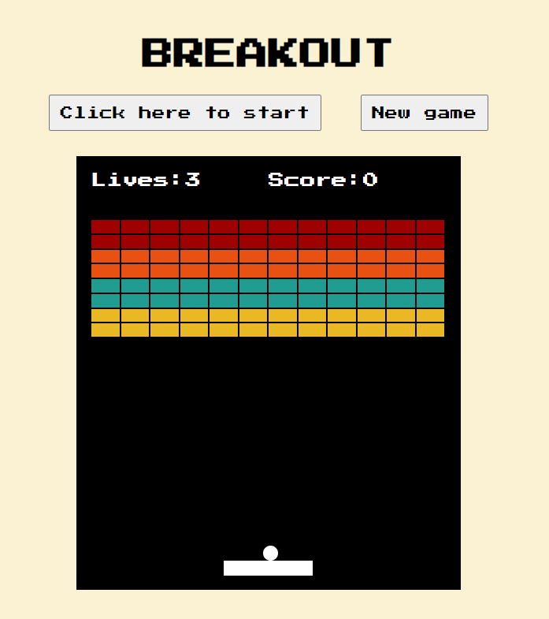

#Break(out)
My attempt at the classic video game Breakout. Move the paddle to hit the ball to break the bricks. Clear all bricks and you win!

 

##How to play
Easy! [Play Break(out)](https://triin1.github.io/Breakout/)

To play, move the paddle using either:
* A and D keys or
* left and right arrow keys on your keyboard.

Click the "Click here to start" button once to begin your game. Pressing it more than once during your game will speed up the ball (a lot). Game starts automatically (after the countdown) after losing a life. You have three attempts/lives to try to break all the bricks. 

##Languages used
* HTML
* CSS
* JavaScript